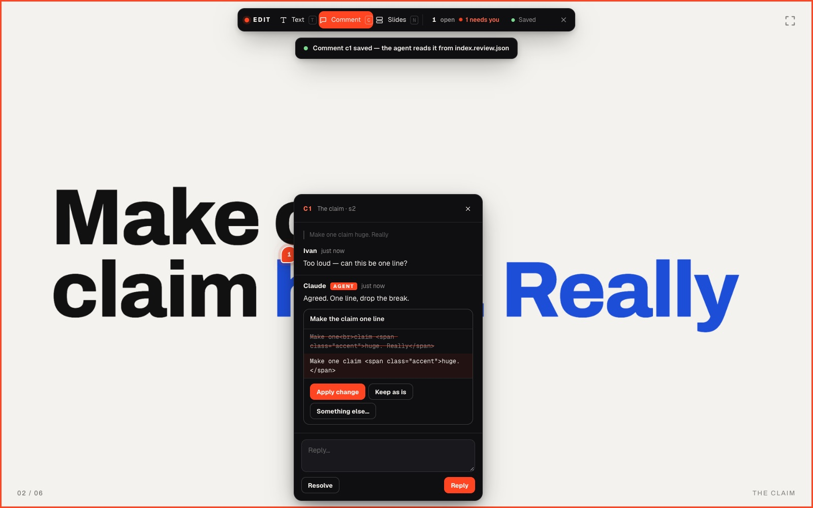

<p align="center">
  <picture>
    <source media="(prefers-color-scheme: dark)" srcset="assets/banner-dark.svg">
    
  </picture>
</p>

<p align="center">
  <a href="https://tomacco.github.io/deckadence/"><b>See it live</b></a>. The landing page is itself a Deckadence deck.
</p>

---

**Deckadence** is a skill for [Claude Code](https://claude.com/claude-code). Ask Claude for a
presentation and you get one HTML file: your ideas placed on a large plane, a camera that
moves from one to the next, headings that rise a line at a time, and diagrams that draw
themselves while you speak.

Nothing to install for your audience. It opens in any browser, works on a phone after the
talk, and lives in git like the rest of your work.

It was built for **[Rules, Not Vibes](https://tomacco.github.io/rules-not-vibes/)**, a talk at
the Claude event on June 10, 2026, and given to the people in the room. Every rule in it came
from making that deck work on the night.

## What you get

- **A camera over a world.** Each slide is a place on a plane. The camera glides between
  them, dives in for a big moment, and steps back to show the whole map when you press `O`.
- **Reveals with timing.** Headings rise line by line, supporting text follows, and animated
  scenes stop cleanly when you move on and replay when you come back.
- **Drawings that happen live.** Diagrams, paths and marks draw themselves in the order you
  tell the story.
- **Your brand, or a considered default.** The skill asks for your design reference first and
  treats it as the contract. Without one it picks from seven directions (Brutalist,
  Editorial, Terminal, Swiss, Playful, Midnight Luxe, Gallery), says which and why, and offers
  to swap.
- **Built for the person presenting.** Arrow keys and space, an overview, a clickable progress
  rail, full screen with `F`, and stable station keys like `LYRA` that survive a reorder. Say
  "fix LYRA" in review and it still means the same slide tomorrow. `#LYRA` deep-links to it.
- **Good on phones.** Swipe to navigate, a full-screen button, a rotate hint for portrait, and
  a letterbox that matches each slide. People reopen good talks on the way home.
- **Edit mode.** Serve the deck with `node components/edit/serve.mjs deck/index.html` and open
  it with `?edit=1`. Change text where it stands, pin comments for Claude, accept or decline
  its proposals, drag slides into a new order. Everything is written back into the HTML and
  one sidecar JSON file that Claude reads. It is off by default and never on while you present.
- **Long decks stay light.** Only the stations near the camera are in the page; the rest wait as
  text and come back on approach, so memory stays flat from slide 3 to slide 70.
  `components/stream/pack.mjs` publishes a deck whose stations load on demand, or stream from the
  server one by one (`--split`); `components/verify/memory.mjs` measures a deck as it is presented.
- **Checks before you ship.** `components/verify/check.mjs` runs static gates on the file
  (layout staircase, keys, scene wiring, phone chrome). `components/verify/shoot.sh` takes a
  still screenshot of every slide, so Claude looks at the deck before calling it done.
  `components/verify/flash.mjs` walks the deck in a real browser and fails if anything
  appears finished, vanishes and animates in again as you arrive.
- **Twenty-two traps already handled.** Words broken mid-line, a finished frame flashing
  before its animation, reduced-motion settings killing the show, iframes that balloon. Each
  one is written down in `references/pitfalls.md` with its fix built into the template.

<p align="center">
  
</p>

## Install

```bash
# macOS / Linux
git clone https://github.com/tomacco/deckadence ~/.claude/skills/deckadence

# Windows (PowerShell)
git clone https://github.com/tomacco/deckadence "$env:USERPROFILE\.claude\skills\deckadence"
```

Then open Claude Code and ask:

> *"Make me a deck about how our migration actually went."*

Claude asks whether you have a design reference, maps your story into stations for you to
approve, builds the file, and screenshots every slide before handing it over.

To update later: `git -C ~/.claude/skills/deckadence pull`.

## How it works

```
your story  ──▶  stations on one plane      ──▶  a camera that moves
                 (1920×1080 frames, each         (anime.js v4 animates a single
                  step goes right or down)        {x, y, zoom} object)
```

| Piece | What it does |
|---|---|
| `template/starter.html` | A complete six-station deck: engine, HUD, navigation, phone layer, one animated SVG scene. Every build starts from a copy of it. |
| `SKILL.md` | The workflow Claude follows: design direction, story, layout, animation, verification, review. |
| `references/` | The craft in depth: engine internals, motion, SVG recipes, the design directions, edit mode, and the pitfalls list. |
| `components/` | Code to splice in rather than retype: verification gates, a question-then-reveal scene, a fly-through, live-website stations, isometric scenes, and edit mode. |

The engine is about 500 lines of commented JavaScript inside the template. No framework and
no build step.

## Rules it keeps

Each one was paid for with a real bug or a deck that looked wrong.

1. Every station arrives with a transition, even a quiet one.
2. One element owns each moment. If two things pulse, neither is the focus.
3. Headings split into lines, never characters. Character splitting breaks words mid-word.
4. Initial states are set before anything is visible, so the finished frame never flashes.
5. Motion is content. Reduced-motion gets calmer timing, never a dead cut.
6. Auto-playing sequences stop at the end. They never loop over the speaker.
7. One accent color per station, used on purpose.

## Try the template

```bash
open template/starter.html        # macOS
start template\starter.html       # Windows
```

It runs from a double-click. It loads anime.js and its fonts from CDNs, so vendor both before
presenting somewhere with bad wifi. `→` advances, `O` shows the overview, `F` goes full
screen, and `#s3` or `#LYRA` in the URL jumps to a station.

## Tests

```bash
node --test tests/*.test.mjs
```

No dependencies: Node 22+ and, for the browser tests, Chrome or Chromium (set `DECK_BROWSER`
to its path if it isn't found; without one those tests are skipped). The suite checks that
the static gates pass the template and the landing and fail each kind of broken deck, that
edit mode writes back byte-exact and keeps the deck valid, and that no station flashes in a
real browser, including a test that puts the old flash bug back and expects the probe to
catch it. GitHub Actions runs it on every pull request and on every push to `main`.

## Credits

Made by **[Ivan "Tomacco"](https://github.com/tomacco)** and **Claude**, on stage and behind
it. Born from *Rules, Not Vibes* with **Laura "Rose Days"**, a talk about why on-brand is a
set of rules a machine can follow. This skill is those rules, applied to presentations.

Animation by [anime.js v4](https://animejs.com). Type on the landing page: Newsreader
(Production Type) and Inter (Rasmus Andersson). MIT licensed.
